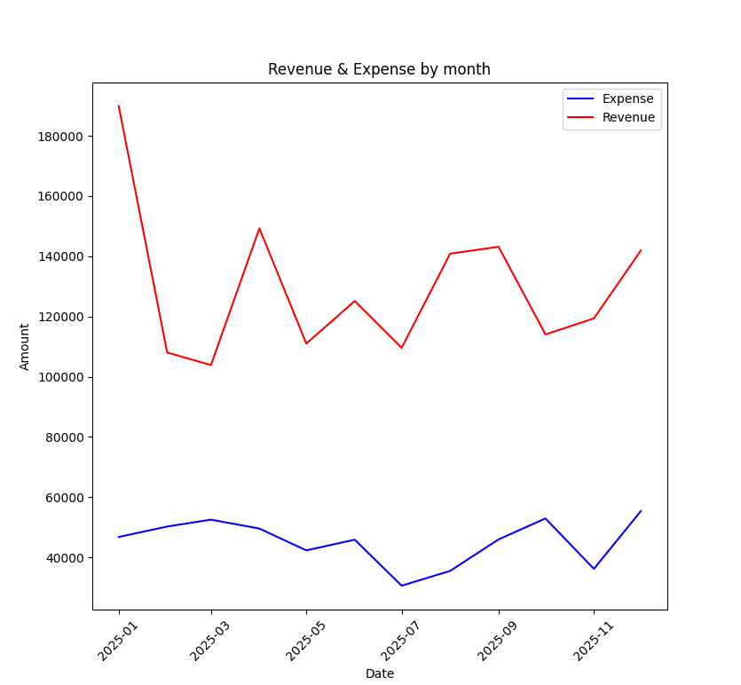
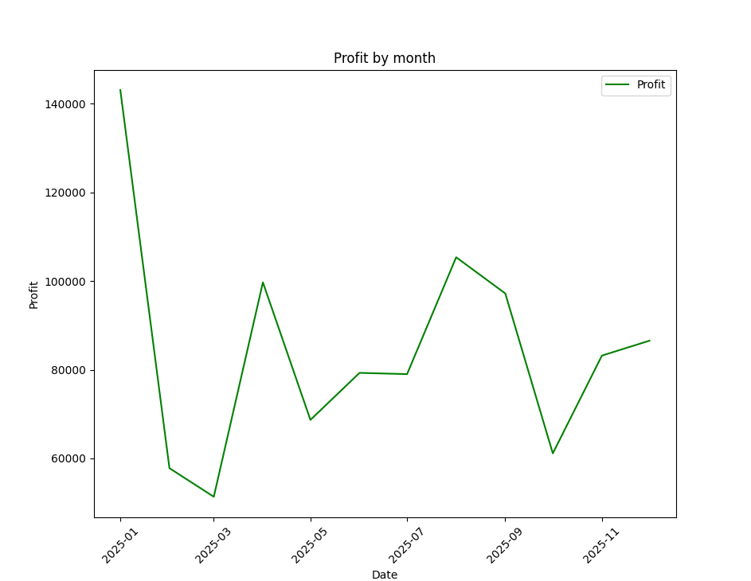
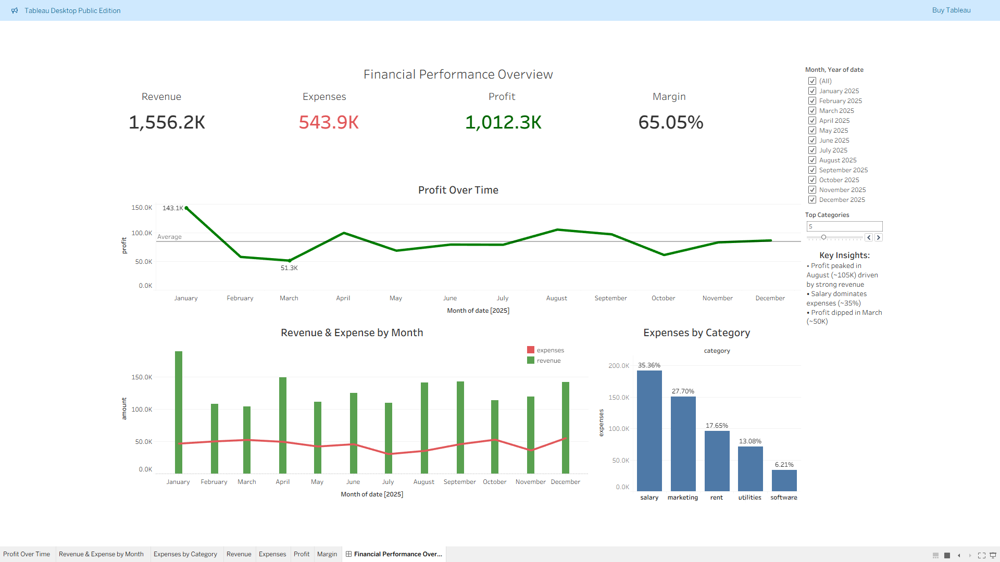
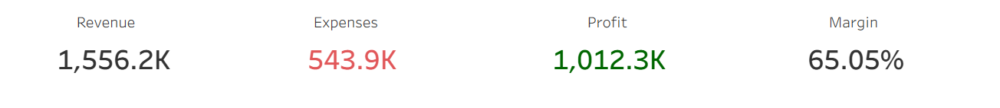
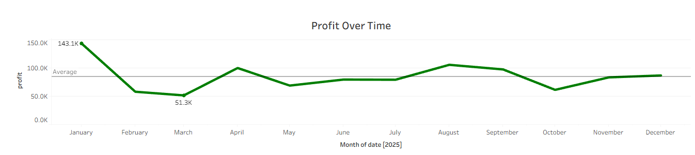
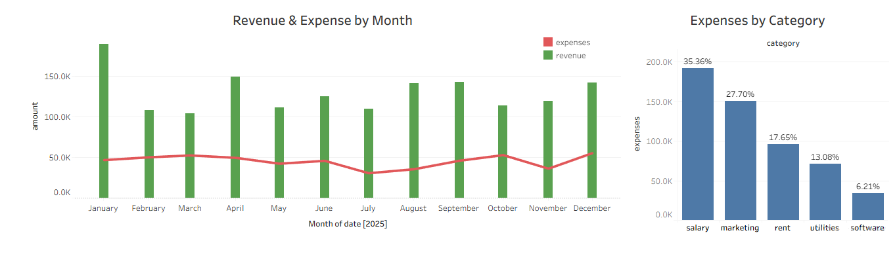

# Financial Data Analysis Project

This project simulates and analyzes financial data for a small business to uncover trends, identify key cost drivers, and highlight opportunities for optimization.

It leverages Python (Pandas, Matplotlib) for data processing, PostgreSQL for data storage and querying, and Tableau for interactive visualization.

The project represents an end-to-end data analytics workflow, covering data generation, analysis, and business insight extraction.

## Dataset Description
The dataset contains daily financial transactions for the year 2025, including:
- Revenue (Sales, Services)
- Expenses (Salary, Marketing, Operations, etc.)
- Transaction date

## Tools & Technologies
- Python (Pandas, Matplotlib)
- PostgreSQL (data storage and SQL analysis)
- Tableau (data visualization and dashboarding)
- CSV (data source)

## Project Structure
- data/ — dataset (CSV file)
- src/ — Python scripts for data generation and analysis
- sql/ — SQL queries for data analysis (PostgreSQL)
- outputs/ — generated visualizations and Tableau dashboard files

## How to Use

This project can be adapted for analyzing financial data of any small business.

To use it with your own data:
1. Replace the `transactions.csv` file with your dataset
2. Ensure the following structure is preserved:
   - `date` — transaction date
   - `type` — revenue or expense
   - `category` — category of transaction
   - `amount` — transaction value

The analysis scripts and visualizations will automatically adapt to the new data. This makes the project reusable for real-world business scenarios.

## Visualizations

## Tableau Dashboard

### KPI Overview

### Trend Analysis

### Expense Breakdown

The interactive dashboard was built in Tableau to complement the Python analysis and provide a business-oriented view of financial performance.

**Key features:**

* KPI tracking: Revenue, Expenses, Profit, Profit Margin
* Time-series analysis of revenue and profit trends
* Expense breakdown by category
* Dynamic Top N filtering using a parameter
* Interactive filtering for flexible data exploration

**File:**

* `outputs/finance_dashboard.twbx`

## SQL Analysis (PostgreSQL)

This project includes SQL-based data analysis using PostgreSQL.

### Key components:

* **Exploratory Data Analysis (EDA)**
  Basic dataset validation and structure checks

* **KPI Calculation**
  Total revenue, expenses, and profit (simple and CTE-based approaches)

* **Time-based Analysis**
  Monthly aggregation of financial metrics

* **Category Analysis**
  Expense breakdown by category

* **Advanced SQL (Window Functions)**

  * Ranking categories by expenses
  * Contribution (%) calculation
  * Cumulative percentage (Pareto analysis)

All queries are available in the `sql/analysis.sql` file.

## Key Insights
Insights are derived from Python analysis, SQL queries, and the Tableau dashboard.

### Financial Overview
- The business remains profitable across the observed period
- Total annual revenue and expenses are summarized through KPI tracking in the dashboard
- Average profit margin: ~65% (based on synthetic data)
- Profitability shows variation throughout the year, with potential seasonal patterns based on one year of data
- Total annual revenue and expenses are clearly visualized through KPI tracking in the dashboard

### Revenue Trends
- Revenue peaks in January, followed by a decline in February–March
- Secondary growth in August–September
- Potential seasonal patterns observed based on one year of data; confirmation would require multi-year data

### Expense Analysis
- Salary (~35%) and Marketing (~28%) are the largest cost drivers
- Fixed costs exceed 50% of total expenses
- Marketing represents the most flexible cost category and a key lever for optimization

### Revenue Structure
- Sales: ~80%
- Services: ~20%
- The business shows high dependency on a single revenue stream

### Business Implications
- Implement retention campaigns after peak revenue periods to reduce post-peak decline (e.g., February–March)
- Reallocate marketing budget towards high-performing periods (January, August–September) to maximize ROI
- Focus cost optimization efforts on top expense categories (Salary, Marketing), which account for the majority of expenses
- Reduce dependency on sales (~80%) by expanding service offerings to stabilize revenue streams
- Use dashboard filtering to identify and monitor high-cost categories for continuous cost control

## Conclusion

This project demonstrates an end-to-end data analytics workflow, from data generation and processing to SQL-based analysis and business-oriented insights. 

It highlights the ability to combine Python, SQL, and Tableau to analyze financial performance, identify key cost drivers, and support data-driven decision-making.
